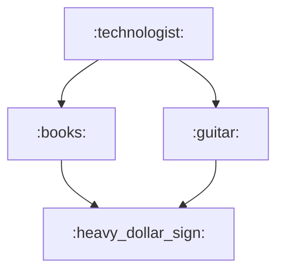

# README Daniel Martins!

## Curso da DIO sobre Git e GitHub, projetos e laboratório sobre cooperação com GitHub.

## Graduações

| Universidade               | Curso                                                |
| ----------------- | ---------------------------------------------------------------- |
| UNINTER      | Geografia|
| UNIVESP       | Ciência de Dados |
| UNIVESP       | Tecnologia da Informção |

## Me siga

